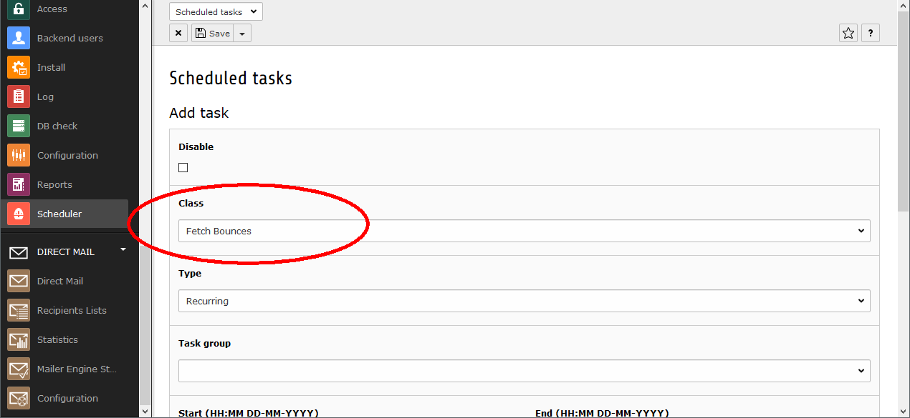

Installation
============

Configuration
"""""""""""""

First step is the configuration of the TYPO3 extension Direct Mail according to their installation and configuration manual.
Make sure to create a new Direct Mail container ready for email dispatch, otherwhise you will not be able to configure Returnmail properly.
Test your Direct Mail setup by sending out some emails.

In the next step you need to add a "Return Path" email address to your Direct Mail container. You can add such an address in the Direct Mail interface in the Configuration menu.
Emails in the "Return Path" email account will be deleted without any further notices or warnings, so make sure that you only use this account as "Return Path" email address.

.. figure:: Images/dmail-configuration.png

Now we need to create a new Scheduler task for Returnmail.
The class of the scheduler task must be "Fetch Bounces". It must be a recurring task in an interval you like.
When ready safe the task.

At last we have to enter the complete connection details of our previously set "Return Path" email account at the extension settings in the extensionmanager. Return mail supports the following mailing protocols: IMAP, POP3 and IMAPS.
Make sure to enter every detail, don't miss out anything. The required inputs are: port (if 0, then it uses the default port), name of the inbox, host of the mailserver, username of the mailbox, password of the mailbox and the amount of mails per cycle.

.. figure:: Images/extensionmanager.png

With this step the configuration of Returnmail is complete. The scheduled task now fetches the emails on the "Retun Path" email account and analyses them.
You can see the number of the returned emails with their return reason in the Direct Mail interface at Statistics. There you can choose between the sent emails. The statistics will be displayed at the bottom of the detailed view of each email.

.. figure:: Images/mails-returned.png

If you use GMail as returnmail account, take a look on this website: https://www.google.com/settings/security/lesssecureapps
