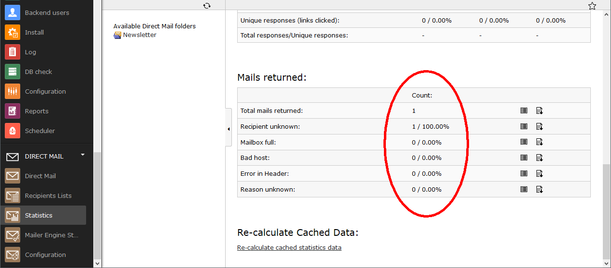

Introduction
============

What does it do?
----------------

The extension Returnmail has been developed by the company Webprofil and is supported by Reelworx. This extension makes it possible to analyse the email dispatch of directmail.
Returnmail automatically downloads the returned mails of the failed dispatches and analyses them for their return code.
This return code will be written into the direct mail log table and is displayed in the statistics category of each mail dispatch.

Screenshots
-----------

This is the output after the proper configuration of the extension Returnmail.

